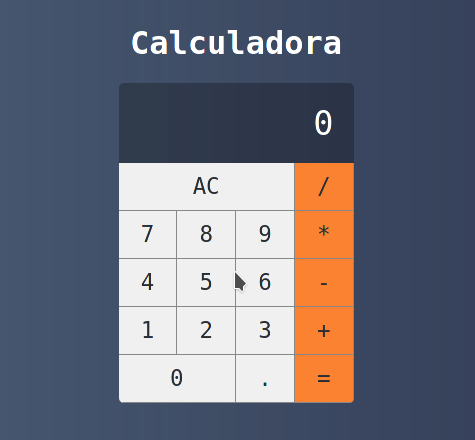

<p align="center">
  
</p>


## 🎯 New features

**Electron wrap version is on the way!**

Comming soon on v0.0.2


## 🧪 Technologies

This project was developed using the following technologies:

- ⚡ [React](https://reactjs.org) - Front-end

- ⚡ [Node.js](https://nodejs.org/en/) - Back-end

  

## 🚀 Getting started

Clone the project and access the folder.

```bash
$ git clone 
```

Follow the steps below:
```bash
# Install the dependencies
$ yarn

or 

$npm (v14.0.0 or older) 

Use NVM, if you will

# Start the project
$ yarn start

$npm install
```
The app will be available for access on your browser at http://localhost:3000

The app was not deployed yet so you'll need to start a development server to use it

## 🔖 Layout

The layout was inspired in MacOS calculator for clear usability advantages, the front end was completely made of **CSS grid and HTML as JSX** in order to read by React.


## 📝 License

This project is licensed under the MIT License. See the [LICENSE](LICENSE.md) file for details.


---

<p align="center">Made with 💜 by Guilherme Martins</p>